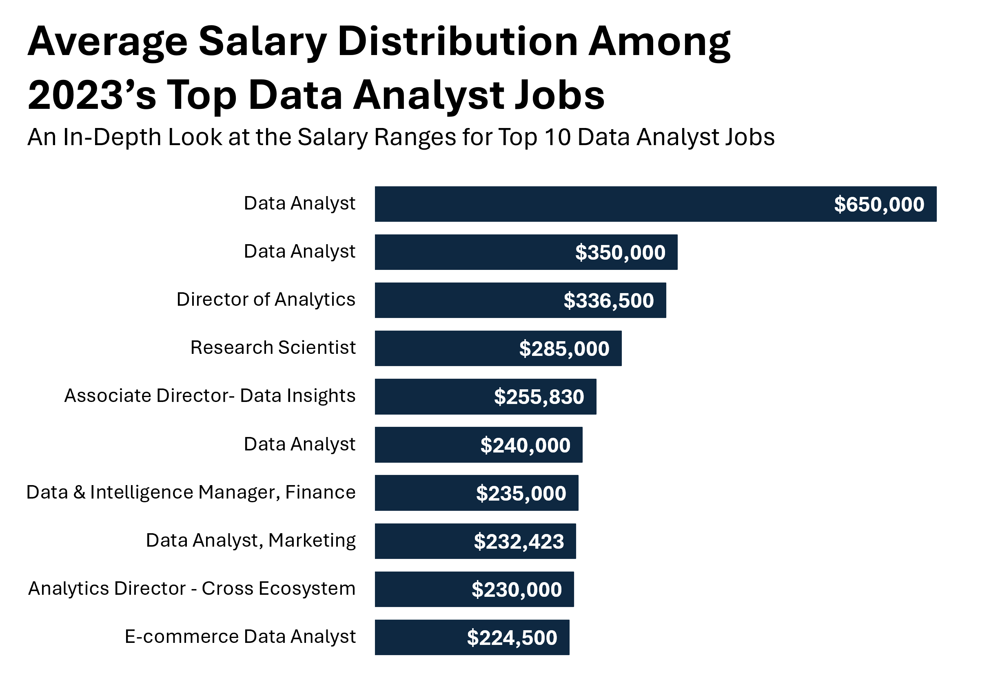
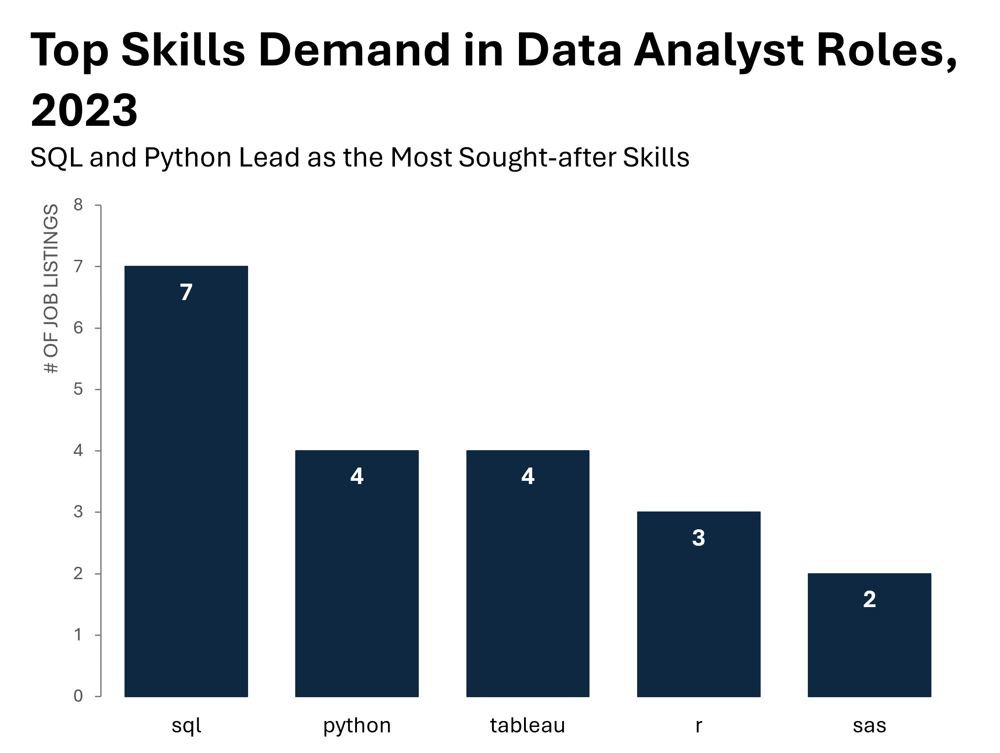

# Introduction
In this project, I analyzed job postings to uncover the top skills required for Data Analyst positions most frequently requested by employers, this project explores top-paying jobs, in-demand skills, and where high demand meets high salary in data analytics.

👉 Explore the SQL queries that powered my analysis here: [project_sql_folder](/project_sql/)

# Background 
Driven by the aim to more effectively navigate the data analyst job market, this project originated from the ambition to identify the skills that are both highly paid and in high demand. This effort was geared towards refining my job search strategy to uncover the essential skills needed to secure my ideal role. 
### Through the lens of SQL queries, I sought to address several key questions:

1. What are the top-paying data analyst jobs?
2. What skills are required for these top-paying jobs?
3. What skills are most in demand for data analysts?
4. Which skills are associated with higher salaries?
5. What are the most optimal skills to learn?
# Tools I Used
In my journey through the data analyst job market, I leveraged a few critical tools that significantly enhanced my analysis:

- **SQL:** This was my main tool for diving into the database, pulling out essential insights.
- **PostgreSQL:** The database system I chose for its robustness, perfect for dealing with complex job postings data.
- **Visual Studio Code:** The primary platform for managing databases and running SQL queries.
- **Excel:** A crucial tool for visualizing the outcomes of my SQL queries.
- **Git & GitHub:** Key for keeping track of my progress and sharing my SQL work, ensuring everything stayed organized and accessible.
# Analysis Breakdown
In this project, every SQL query I executed aimed to uncover specific layers of the data analyst job market. Here's the strategy I took to approach each critical question:
### 1. High-Paying Data Analyst Roles in California
I wanted to find full-time data analyst jobs with the top salaries, whether those positions were in California or offered the flexibility of working remotely. To do this, I filtered by average yearly salaries and job locations, specifically on California and "Anywhere" listings. This query highlights the top-paying opportunities for full-time data analysts, spotlighting the field’s salary leaders.
```sql
SELECT 
    jp.job_id,
    jp.job_title,
    jp.job_location,
    jp.job_schedule_type,
    jp.salary_year_avg,
    jp.job_posted_date,
    cd.name AS company_name
FROM 
    job_postings_fact jp
    LEFT JOIN company_dim cd 
    ON jp.company_id = cd.company_id
WHERE 
    jp.job_title_short = 'Data Analyst'
    AND (jp.job_location LIKE '%, CA' OR jp.job_location = 'Anywhere')
    AND jp.salary_year_avg IS NOT NULL
    AND EXTRACT(YEAR FROM jp.job_posted_date) = 2023
    AND jp.job_schedule_type = 'Full-time'
ORDER BY 
    jp.salary_year_avg DESC
LIMIT 10;
```
Here's the breakdown of the top data analyst jobs in 2023:
- **Wide Salary Range:** The salary range for the top 10 Data Analyst roles is quite broad, with figures stretching from **$224,500** to an impressive **$650,000**.
- **Diverse Opportunities:** The job titles themselves show great variety, from "Data Analyst" to "Director of Analytics," indicating the depth of specialization and opportunities within the field.
- **Title Diversity:** The array of companies offering these salaries is diverse, encompassing Mantys, Anthropic, and Meta, demonstrating that high pay can be found in various corners of the tech industry.


*Bar graph visualizing the salary for top the top 10 salaries for data analyst located in California; I used Excel to generate this graph from my SQL query results.*
### 2. Skills for Top-Paying Data Analyst Jobs
To understand the skill set behind these lucrative data analyst roles, I pulled the top-paying jobs from my initial search and joined them with the related skills data. This SQL query connected the high salaries to the specific skills needed for each role, painting a clearer picture of the technical and analytical competencies commanding premium pay in the market.
``` sql
WITH top_paying_jobs AS (
    SELECT 
        jp.job_id,
        jp.job_title,
        jp.salary_year_avg,
        cd.name AS company_name
    FROM 
        job_postings_fact jp
    LEFT JOIN company_dim cd ON jp.company_id = cd.company_id
    WHERE 
        jp.job_title_short = 'Data Analyst'
        AND (jp.job_location LIKE '%, CA' OR jp.job_location = 'Anywhere')
        AND jp.salary_year_avg IS NOT NULL
        AND EXTRACT(YEAR FROM jp.job_posted_date) = 2023
        AND jp.job_schedule_type = 'Full-time'
    ORDER BY 
        jp.salary_year_avg DESC
    LIMIT 10
)

SELECT 
    tpj.*,
    sd.skills
FROM 
    top_paying_jobs tpj
INNER JOIN skills_job_dim sjd ON tpj.job_id = sjd.job_id
INNER JOIN skills_dim sd ON sjd.skill_id = sd.skill_id
ORDER BY
    tpj.salary_year_avg DESC;
```
The results were telling:

- **In-Demand Skills:** The SQL query revealed that SQL, Python, and R are among the most in-demand skills for the highest-paying data analyst jobs, with SQL appearing as a common requirement across different roles and companies.
- **Skill Variance Across Roles:** There was a notable variance in skills among different job titles. For instance, Data Analyst positions emphasized Python and SQL, whereas roles like "Analytics Director" and "Data & Intelligence Manager" often required a broader skill set, including data visualization tools like Tableau and business intelligence platforms like Power BI.
- **Tech-Savvy Employers:** The high-paying roles are available at tech-centric companies like Anthropic, Meta, and TikTok, which tend to look for candidates with a strong foundation in programming, data manipulation, and visualization skills.


*The analysis of these skills not only informs about what employers are currently seeking but also serves as a guide for professionals aiming to enter the top tiers of the data analyst job market.*
### 3. Most In-Demand Skills for Data Analysts
To zero in on the skills most sought after by employers for data analyst positions, I executed a SQL query to aggregate and count the frequency of each skill mentioned across job listings. The focus was on full-time roles in California or remote positions posted in 2023. This approach not only identifies the most in-demand skills but also quantifies their demand, providing a clear indicator of what skills data analysts should prioritize.
```sql
SELECT 
    sd.skills,
    COUNT(sjd.job_id) AS demand_count
FROM 
    job_postings_fact jp
INNER JOIN 
    skills_job_dim sjd ON jp.job_id = sjd.job_id
INNER JOIN 
    skills_dim sd ON sjd.skill_id = sd.skill_id
WHERE 
    jp.job_title_short = 'Data Analyst'
    AND (jp.job_location LIKE '%, CA' OR jp.job_location = 'Anywhere')
    AND jp.salary_year_avg IS NOT NULL
    AND EXTRACT(YEAR FROM jp.job_posted_date) = 2023
    AND jp.job_schedule_type = 'Full-time' 
GROUP BY 
    sd.skills
ORDER BY 
    demand_count DESC
LIMIT 10;
```
The query's findings reveal:

- **SQL Reigns Supreme:** SQL stands out as the most demanded skill with 781 listings, underscoring its foundational role in data analysis.
- **Essential Tools:** Excel follows with 518 mentions, reflecting its ubiquitous use in data tasks, with Python close behind at 483 mentions, highlighting the importance of programming skills.
- **Visualization and Statistical Software:** Tableau and R are also highly sought after, with 452 and 291 mentions, respectively, indicating a strong demand for data visualization and statistical analysis capabilities.
- **Specialized Software Knowledge:** Skills in SAS, Power BI, and other specific tools like PowerPoint, Word, and Oracle show significant demand, illustrating the diverse toolkit that employers expect from data analysts.

| Skill      | Demand Count |
|------------|--------------|
| SQL        | 781          |
| Excel      | 518          |
| Python     | 483          |
| Tableau    | 452          |
| R          | 291          |
| SAS        | 230          |
| Power BI   | 218          |
| PowerPoint | 129          |
| Word       | 118          |
| Oracle     | 83           |

*This analysis underscores the key skills data analysts need to master to be competitive in the job market, from essential data management with SQL to advanced analytics with Python and R, and effective presentation with Power BI and Tableau.*
### 4. Skills Linked to Higher Salaries for Data Analysts
To explore which skills are associated with higher average salaries for Data Analyst roles, I employed a SQL query that averages yearly salaries by skill. This analysis, focusing on full-time roles in California or remote positions posted in 2023, provides insights into the technical and analytical skills that may lead to better compensation.
```sql
SELECT 
    sd.skills,
    CAST(AVG(jp.salary_year_avg) AS DECIMAL(10, 2)) AS avg_salary
FROM 
    job_postings_fact jp
INNER JOIN 
    skills_job_dim sjd ON jp.job_id = sjd.job_id
INNER JOIN 
    skills_dim sd ON sjd.skill_id = sd.skill_id
WHERE 
    jp.job_title_short = 'Data Analyst'
    AND (jp.job_location LIKE '%, CA' OR jp.job_location = 'Anywhere')
    AND jp.salary_year_avg IS NOT NULL
    AND EXTRACT(YEAR FROM jp.job_posted_date) = 2023
    AND jp.job_schedule_type = 'Full-time' 
GROUP BY 
    sd.skills
ORDER BY 
    avg_salary DESC
LIMIT 25;
```
Here's what the query revealed about skills and average salaries:

- **Top-Earning Skills:** Specialized tools and programming languages like Asana, MXNet, and Bitbucket lead the list, with Asana-related roles averaging $235,000 annually.
- **High Demand for Advanced Tech:** Skills in advanced tech and programming frameworks such as Node, Keras, and Cassandra also command high salaries, showing the value of niche technical expertise in the data analytics field.
- **Emerging Tech Pays Well:** Newer or less common skills in the data world, like DynamoDB, Watson, and Couchbase, offer substantial earnings, indicating that keeping up with emerging tech can be highly lucrative.

| Skill       | Average Salary |
|-------------|----------------|
| Asana       | $235,000.00    |
| MXNet       | $198,000.00    |
| Bitbucket   | $189,154.50    |
| Node        | $180,000.00    |
| Keras       | $174,040.00    |
| Cassandra   | $168,694.83    |
| DynamoDB    | $165,000.00    |
| Watson      | $160,515.00    |
| Couchbase   | $160,515.00    |
| Puppet      | $159,640.00    |
| Ansible     | $159,640.00    |
| DataRobot   | $155,485.50    |
| GitLab      | $154,500.00    |
| Swift       | $153,750.00    |
| PyTorch     | $153,226.17    |
| Perl        | $152,623.89    |
| TensorFlow  | $152,135.70    |
| PySpark     | $146,095.28    |
| Golang      | $145,000.00    |
| Scala       | $143,502.14    |
| Numpy       | $142,960.23    |
| PHP         | $140,601.36    |
| Pandas      | $139,604.25    |
| Databricks  | $135,473.79    |
| Jupyter     | $134,254.21    |

*This analysis underscores the importance of specialized, advanced, and emerging tech skills in achieving higher compensation levels in data analytics roles.*
### 5. Skills, Demand, and Salary Analysis for Data Analysts
To meld the insights on skills demand with their corresponding average salaries, my final SQL query focused on revealing which skills not only are most requested but also carry higher average salaries. Targeting full-time Data Analyst roles in California or remote, from 2023 postings, this query smartly combines demand and salary data to pinpoint the most lucrative skills in the field.

```sql
SELECT 
    sd.skill_id,
    sd.skills,
    COUNT(sjd.job_id) AS demand_count,
    CAST(AVG(jp.salary_year_avg) AS DECIMAL(10, 0)) AS avg_salary
FROM 
    job_postings_fact jp
INNER JOIN 
    skills_job_dim sjd ON jp.job_id = sjd.job_id
INNER JOIN 
    skills_dim sd ON sjd.skill_id = sd.skill_id
WHERE
    jp.job_title_short = 'Data Analyst'
    AND (jp.job_location LIKE '%, CA' OR jp.job_location = 'Anywhere')
    AND jp.salary_year_avg IS NOT NULL
    AND EXTRACT(YEAR FROM jp.job_posted_date) = 2023
    AND jp.job_schedule_type = 'Full-time'
GROUP BY
    sd.skill_id
HAVING
    COUNT(sjd.job_id) > 10
ORDER BY
    avg_salary DESC,
    demand_count DESC
LIMIT 25;
```
Key findings include:

- **High-Value Skills:** Skills like Numpy, PHP, and Pandas not only are in demand but also command impressive average salaries, suggesting that expertise in specific programming languages and tools is particularly valued.
- **Tech Stack Diversity:** From data processing frameworks like Spark and Airflow to database technologies like Cassandra and Databricks, the variety in the tech stack reflects the broad scope of knowledge sought after in the data analytics sector.
- **Emerging Technologies:** Skills associated with emerging technologies and platforms, such as GCP (Google Cloud Platform) and BigQuery, show that cloud-based data processing and analysis capabilities are increasingly crucial, alongside traditional programming skills.

| Skill ID | Skill        | Demand Count | Average Salary |
|----------|--------------|--------------|----------------|
| 94       | numpy        | 11           | $142,960       |
| 25       | php          | 11           | $140,601       |
| 93       | pandas       | 18           | $139,604       |
| 75       | databricks   | 14           | $135,474       |
| 96       | airflow      | 23           | $132,269       |
| 92       | spark        | 32           | $128,875       |
| 141      | express      | 35           | $127,218       |
| 216      | github       | 13           | $124,174       |
| 97       | hadoop       | 31           | $123,829       |
| 81       | gcp          | 11           | $120,286       |
| 234      | confluence   | 15           | $117,930       |
| 57       | postgresql   | 11           | $117,555       |
| 77       | bigquery     | 23           | $116,987       |
| 8        | go           | 70           | $115,131       |
| 185      | looker       | 81           | $114,215       |
| 80       | snowflake    | 73           | $113,353       |
| 112      | plotly       | 14           | $112,421       |
| 23       | crystal      | 15           | $112,050       |
| 15       | matlab       | 24           | $111,981       |
| 78       | redshift     | 31           | $111,128       |
| 1        | python       | 483          | $110,968       |
| 194      | ssis         | 23           | $110,692       |
| 215      | flow         | 57           | $110,400       |
| 4        | java         | 31           | $110,100       |
| 233      | jira         | 31           | $109,207       |
*This comprehensive look at skill demand and salary implications offers data analysts clear directions on skill development priorities, highlighting the areas most likely to lead to lucrative opportunities in today's job market.*
# What I Learned
Diving into the data analyst job market, my SQL-driven analysis unveiled several key insights that not only refined my understanding of the field but also illuminated the path for future learning and career development. Here's a snapshot of the pivotal learnings:

- **SQL's Dominance:** Its prevalence across high-paying jobs underscores its non-negotiable importance in data analytics. Mastery of SQL appears to be a cornerstone skill for aspiring data analysts.

- **Python's Versatility:** The high demand for Python reflects its versatility and power in data analysis, emphasizing the need for proficiency in programming languages that offer extensive libraries and frameworks for data science.

- **Specialized Skills Pay Off:** The analysis highlighted that niche skills related to specific tools and technologies, such as Databricks, Airflow, and TensorFlow, are associated with higher salaries. This suggests a valuable strategy of specializing in areas that are both in demand and less saturated.

- **The Value of Cloud and Big Data Technologies:** Skills in cloud services (GCP, AWS) and big data technologies (Hadoop, Spark) not only are in demand but also command higher salaries, pointing to the growing importance of cloud computing and big data expertise in today's data-driven landscape.

- **Emerging Technologies Are Worth Exploring:** The lucrative salaries tied to emerging technologies and platforms indicate that staying current with new tools and languages can significantly enhance one's career prospects and salary potential.

This journey through SQL queries and data analysis has not only sharpened my technical skills but also provided a clear direction for future learning. It's evident that a blend of foundational skills, like SQL and Python, combined with specialized knowledge in emerging technologies, positions data analysts for success in the evolving job market.
# Conclusion
Through the lens of SQL queries and meticulous analysis, my exploration of the data analyst job market in 2023 has been both enlightening and empowering. By dissecting the landscape for high-paying roles, in-demand skills, and the correlation between specific competencies and salary levels, several key themes have crystallized:

- **The Bedrock of SQL and Python:** These technologies remain at the heart of data analytics, underscoring their status as essential skills for anyone looking to make their mark in this field.
- **Specialization as a Strategy for Growth:** Diving deeper into niche areas and mastering specific tools can significantly elevate one’s value and salary potential in the job market.
- **The Rising Tide of Cloud and Big Data:** Proficiency in cloud platforms and big data technologies is not just beneficial—it’s becoming indispensable for data professionals.
- **Keeping Pace with Innovation:** The analysis revealed that an openness to learning and adapting to emerging technologies can open doors to the most lucrative opportunities.
This project has not only broadened my technical and analytical skills but also provided a strategic roadmap for navigating my career path in data analytics. The insights gained underscore the importance of continuous learning and specialization, particularly in areas where high demand meets high salary. As the field of data analytics continues to evolve, staying informed and agile will be key to unlocking the most rewarding opportunities.

In conclusion, the journey through data, queries, and visualizations has not just been about understanding the market—it's about positioning oneself to thrive in it. The path forward is clear: hone in on foundational skills, specialize where it counts, and always stay ahead of the curve.
